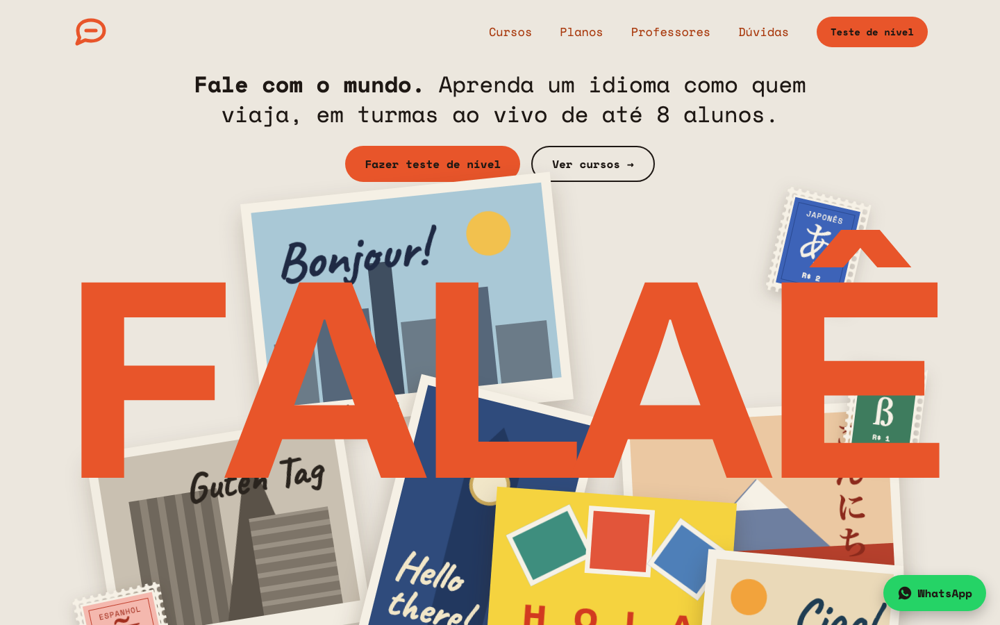
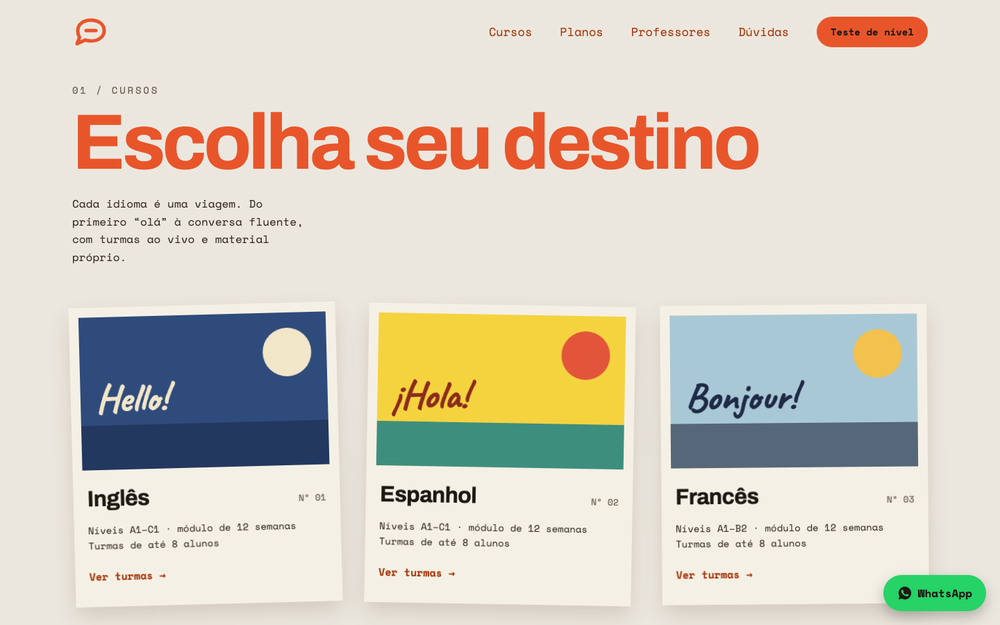
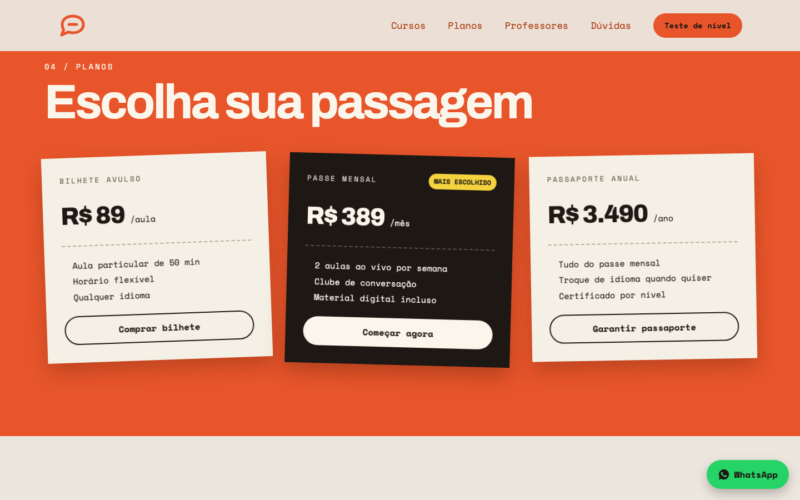
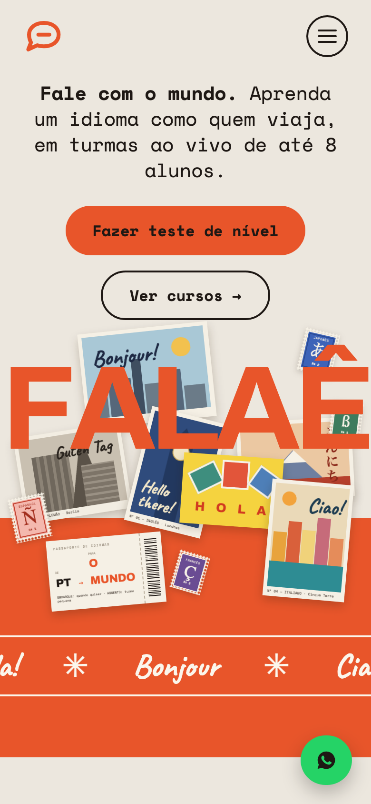

# Falaê — Escola de Idiomas

> Projeto criado para complementar o meu portfólio pessoal: **[portifolio-heitor.vercel.app](https://portifolio-heitor.vercel.app/)**
>
> A Falaê é uma escola fictícia — nomes, preços e contatos são só para demonstração.

Landing page de uma escola de idiomas online, com turmas ao vivo de até 8 alunos. A identidade visual brinca com a ideia
de viagem: cartões-postais, selos e passagens — cada idioma é um destino.

## O que tem no site

- **Cursos** — inglês, espanhol, francês, italiano, alemão e japonês, cada um apresentado como um cartão-postal.
- **Como funciona, professores e depoimentos** — explicam a metodologia e quem dá as aulas.
- **Planos** — bilhete avulso, passe mensal e passaporte anual.
- **Teste de nível grátis** — formulário de captação de contatos (envia para um endpoint configurável ou guarda no navegador na demo).
- **Clube de conversação, FAQ e botão de WhatsApp** — para tirar dúvidas e falar com a escola.

  

## Tecnologias

React 19, TypeScript, Tailwind CSS v4 e Vite.

## Acesse o site

**[falae-page.vercel.app](https://falae-page.vercel.app/)**
